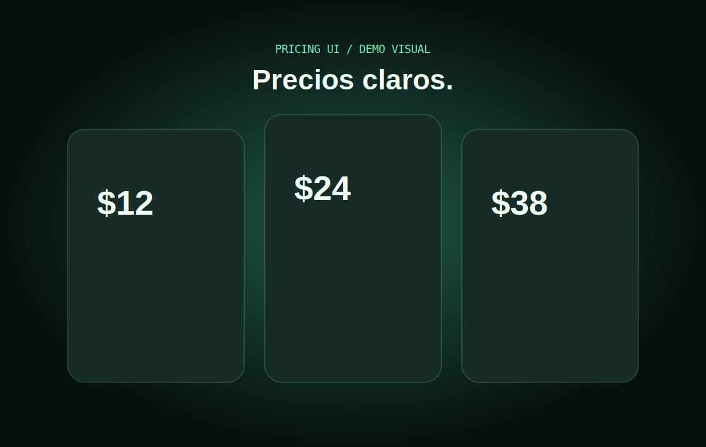

# Glassmorphism Pricing Card

Three illustrative pricing cards with restrained glassmorphism and a monthly/annual selector.

## Features

- Values change without layout shifts.
- Recommended plan with clear hierarchy.
- Explicit demo language, never presented as an offer.
- Focus, hover, and pressed states.

## Live demo

[glassmorphism-pricing-card.netlify.app](https://glassmorphism-pricing-card.netlify.app)

## Installation

Clone the repository, enter `glassmorphism-pricing-card`, and open `index.html`.

## Project structure

Semantic HTML, tokenized CSS, billing JavaScript, SVG assets, and Netlify configuration.

## Customization

Edit `data-monthly`, `data-annual`, each plan list, and the surface tokens.

## Accessibility

Billing uses native radio controls, changes are announced in a status region, and contrast supports each element's purpose.

## Performance

No libraries or external images; switching only updates `textContent`.

## License and credits

[MIT](LICENSE). Created by [Nacho Torres](https://github.com/NachoTorresRD) for [NTDESWEB](https://www.ntdesweb.com) with [NT-SKILL SUPREME](https://github.com/NachoTorresRD/nt-skill-supreme).

[View on GitHub](https://github.com/NachoTorresRD/glassmorphism-pricing-card) · [Work with NTDESWEB](https://www.ntdesweb.com)
